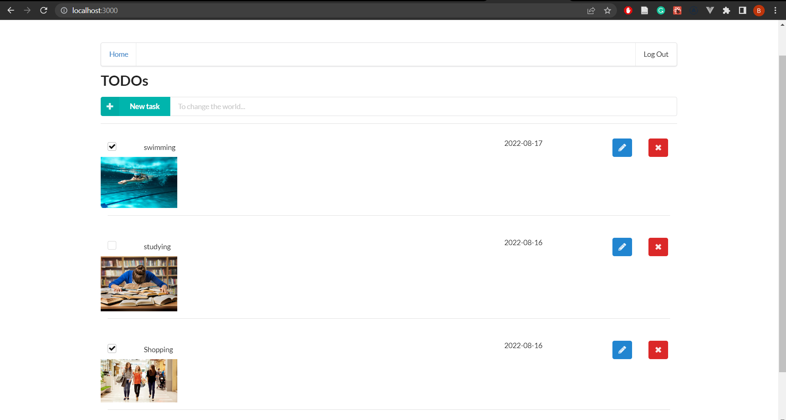
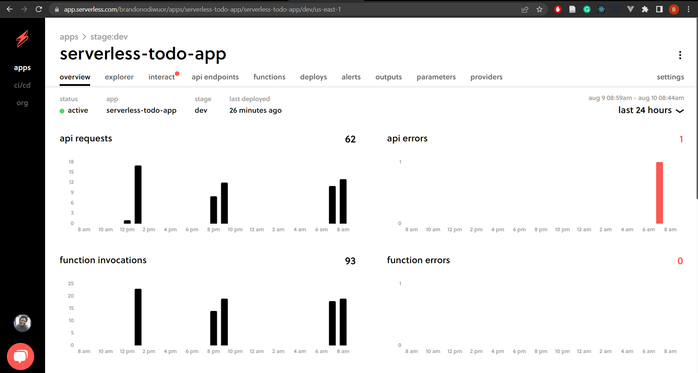
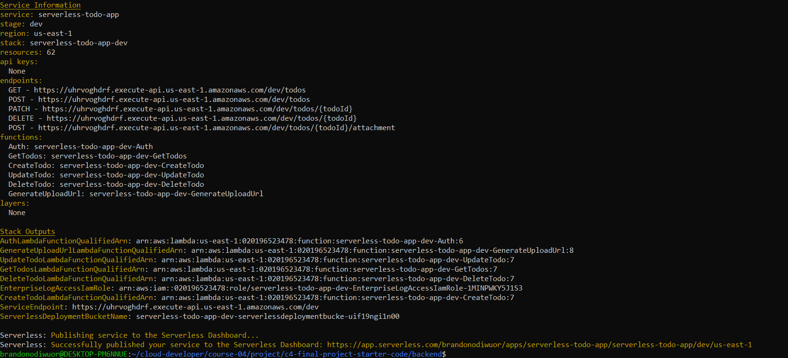
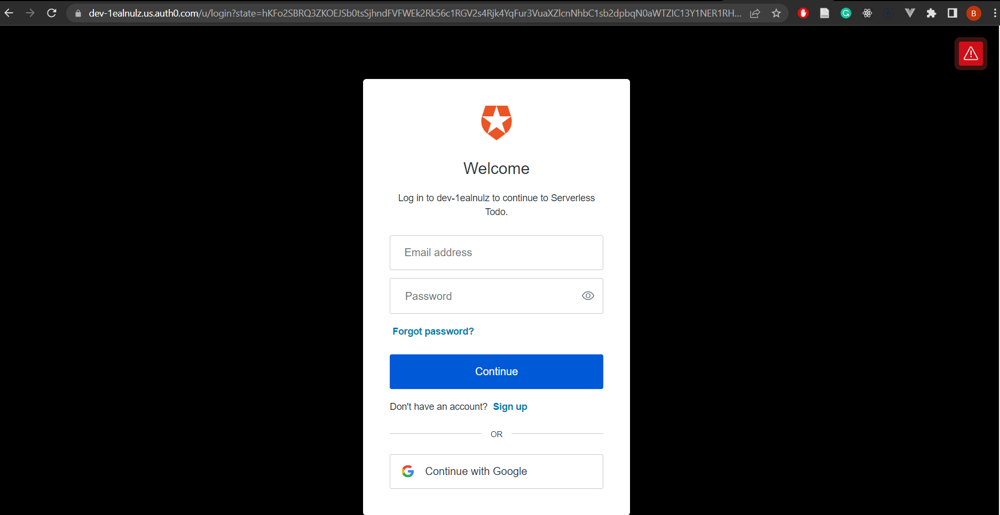
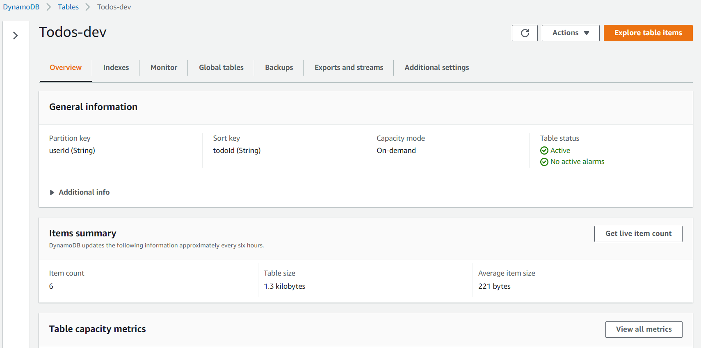
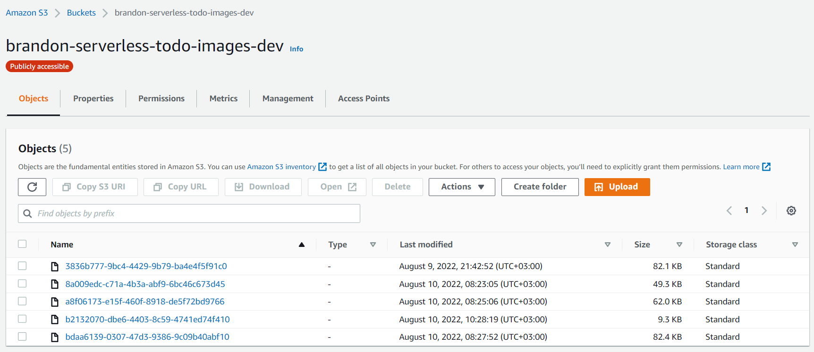

# Serverless TODO: Udacity Cloud Developer Nanodegree - Project 4

Simple Todo application developed using Serverless framework, AWS Lambda, Amazon API Gateway, Amazon DynamoDB, Amazon S3, AWS X-Ray, and Auth0 

## Functionality

* This application will allow creating, removing, updating fetching Todo items (CRUD). 
* Each Todo item can optionally have an attachment image stored on Amazon S3. 
* Each user ONLY has access to Todo items that he/she has created.

# Frontend

React application consuming the serverless backend api (in the `client/` directory)



# Backend

## Lambda Functions

* `Auth` - This function implements a [Lambda (Custom) Authorizer](https://docs.aws.amazon.com/apigateway/latest/developerguide/apigateway-use-lambda-authorizer.html) for API Gateway that authenticates requests to all the other functions.

* `GetTodos` - Return all Todos for a current user.

* `CreateTodo` - Creates a new Todo for a current user.

* `UpdateTodo` - Updates a Todo item created by a current user.

* `DeleteTodo` - Deletes a Todo item created by a current user.

* `GenerateUploadUrl` - Returns a pre-signed URL that can be used to upload an attachment file for a Todo item.


## Serverless Framework

### Serverless Dashboard


### Service Information



## Authentication


## Database
Amazon DynamoDB table which stores users' Todo items
```
KeySchema:
      - AttributeName: userId
        KeyType: HASH
      - AttributeName: todoId
        KeyType: RANGE
```


## File Strorage
Amazon S3 bucket that stores Todo items attachment images



## AWS X-RAY Service Map

